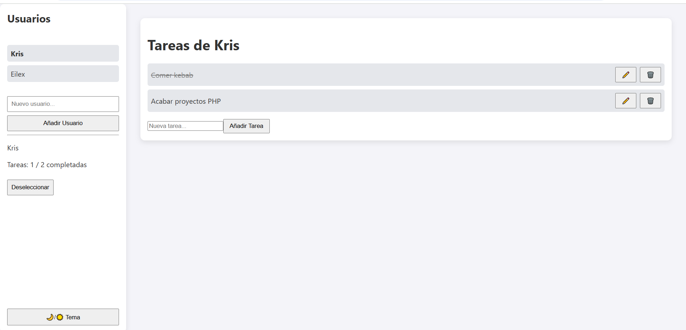

# PF-REACT



---

## Arquitectura:
```text
App
├── Card
│   └── TaskSection
│       └── Task
└── Panel
    ├── UserInfo
    └── UserTag
```

---

### **App:** Componente principal que despliega toda la página web.  

### **Card:** Componente que despliega todo el contenido dentro del **main**.
- **TaskSection:** Componente encargado de mostrar las tareas del usuario.
  - **AddTask():** Función encargada de crear una nueva tarea para el usuario seleccionado.
- **Task:** Componente que muestra la tarea específica y las distintas opciones para interactuar con ella.
  - **ToggleTask():** Función que marca la tarea como completada o viceversa.
  - **EditTask():** Función que permite al usuario cambiar el texto de la tarea.
  - **DeleteTask():** Función que elimina la tarea de la lista del usuario.  

### **Panel:** Componente que despliega todo el contenido dentro del **aside**.
  - **AddUser():** Función encargada de crear un nuevo usuario.
  - **ToggleTheme():** Función que permite al usuario cambiar el tema a claro/oscuro.
- **UserInfo:** Componente que muestra detalles adicionales del usuario seleccionado.
  - **DeselectUser():** Función para deseleccionar el usuario y guardar sus nuevos cambios.
- **UserTag:** Componente que muestra un usuario específico en el panel.
  - **SelectUser():** Función encargada para seleccionar el usuario y guardar los cambios del anterior.

---

## Hooks principales:

- **currentUser:** Indica el usuario que esta seleccionado actualmente.
- **userList:** Lista total de todos los usuarios de la pagina web.
- **userId:** Contador para añadir id's unicos para los nuevos usuarios.
- **taskId:** Contador para añadir id's unicos para las nuevas tareas.
- **theme:** Indica el tema que esta utilizando la pagina.
- **input:** Controla los valores que introduce el usuario en las etiquetas <input>.
